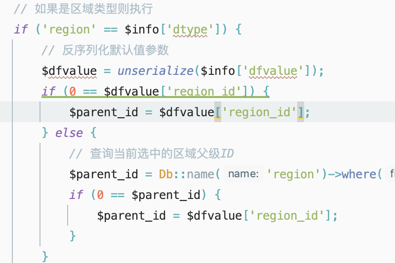
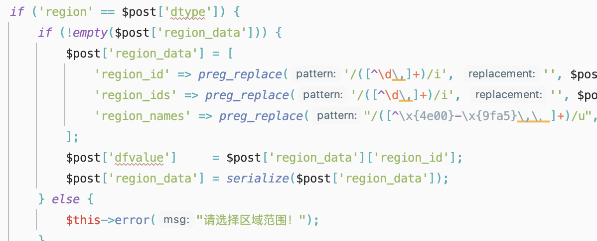
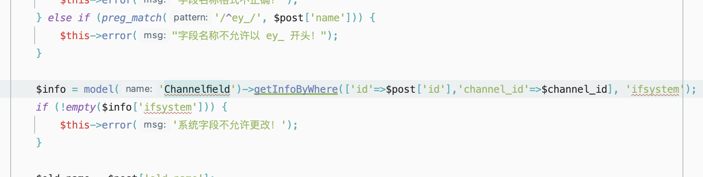

## eyoucms

考点: eyoucms框架、thinkphp反序列化，同一张表在不同方法中出现的危害。

问题点：找不到入口，有一个限制大小

### 思路：

在[Field.php#channel_edit()](/Users/me7eorite/Sites/localhost/application/admin/controller/Field.php)方法中可以发现存在`unserialize()`，它们的参数我们似乎是可控的因为可以通过其它的add方法进行处理。

但是在于[Field.php#channel_add()](/Users/me7eorite/Sites/localhost/application/admin/controller/Field.php)中存在一些缺陷，就是它这边当我们使用region类型的时候，dfvalue的值便无法自己控制

所以想直接通过添加的方式实现反序列化已经不可能了。

通过仔细的分析代码逻辑和查看代码[Field.php#arctype_edit()](/Users/me7eorite/Sites/localhost/application/admin/controller/Field.php)代码中操作的数据和第一个方法中是相同的，所以我们可以通过`arctype_edit()`来修改关键位置的内容

### 

